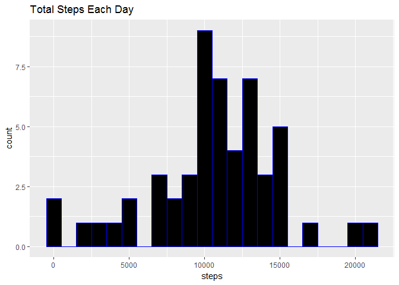
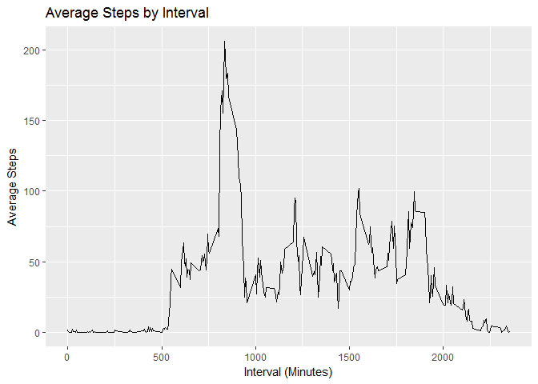
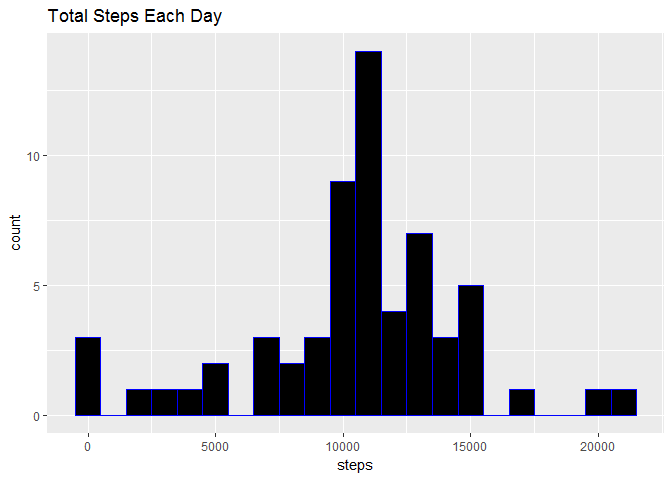
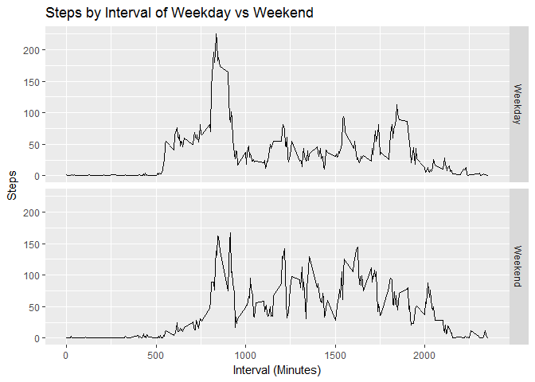

Reproducible Research - Course Project #1
=========================================

#Introduction

Course Project #1 - Reproducible Data

##Load & Process the Data


```r
#download & unzip file
if(!file.exists("repdata%2Fdata%2Factivity.zip")){
    file <- tempfile()
    download.file("https://d396qusza40orc.cloudfront.net/repdata%2Fdata%2Factivity.zip", file)
    unzip(file)
    unlink(file)
    date_downloaded <- date()
}
#store .csv
data <- read.csv("activity.csv", na.strings = "NA")
```

##Q1 - Mean Total Number of Steps Per Day


```r
library(ggplot2)
#total number of steps per day
steps_total <- aggregate(steps ~ date, data, sum)
#create histogram of total steps/day
plot1 <- ggplot(steps_total, aes(steps))
plot1 + geom_histogram(binwidth = 1000, color = "blue", fill = "black") + labs(title = "Total Steps Each Day")
```

<!-- -->

```r
#mean & median steps taken per day
steps_total_mean = mean(steps_total$steps)
steps_total_median = median(steps_total$steps)
```

The toal number of steps taken per day `mean` is 1.0766189\times 10^{4} & the `median` is 10765.

##Q2 - Average Daily Activity Pattern


```r
#average number of steps per day
steps_mean <- aggregate(steps ~ interval, data, mean)
##time series plot
p2 <- ggplot(steps_mean, aes(interval, steps))
p2 + geom_line() + labs(title = "Average Steps by Interval") + xlab("Interval (Minutes)") +  ylab("Average Steps")
```

<!-- -->

```r
#find max steps in interval
interval_max <- steps_mean[which.max(steps_mean$steps),1]
```

The 5 minute interval that contains the max number of steps, averaged across all days, is 835

##Q3 - Imputing Missing Values


```r
#calculate total number of rows with NA
steps_na <- sum(is.na(data$steps))
#fill missing values with mean interval
imputed_data <- transform(data, steps = ifelse(is.na(data$steps), steps_mean$steps[match(data$interval, steps_mean$interval)], data$steps))
#make 2012-10-01 equal to 0, otherwise seems to skew data...
imputed_data[imputed_data$date == "2012-10-01", 1] <- 0
#total number of steps per day, imputed data
steps_total_imputed <- aggregate(steps ~ date, imputed_data, sum)
#create histogram with new dataset
plot3 <- ggplot(steps_total_imputed, aes(steps))
plot3 + geom_histogram(binwidth = 1000, color = "blue", fill = "black") + labs(title = "Total Steps Each Day")
```

<!-- -->

```r
#mean & median steps taken per day w/ imputed data
steps_total_imputed_mean = mean(steps_total_imputed$steps)
steps_total_imputed_median = median(steps_total_imputed$steps)
```

The total number of rows with `NA` is equal to 2304.  The new mean with imputed data is 1.0589694\times 10^{4} and new median with imputed data is 1.0766189\times 10^{4}.  The values differ from the non-imputed data, but only slightly, in regards to mean & median.  

##Q4 - Activity Patterns between Weekdays & Weekends


```r
#create variable containing each day of weekdays
weekday <- c("Monday", "Tuesday", "Wednesday", "Thursday", "Friday")
#add new column that differentiates between weekday and weekend
imputed_data$day <- ifelse(weekdays(as.Date(imputed_data$date)) %in% weekday, "Weekday", "Weekend")
#create faceted time series plot
p2 <- ggplot(imputed_data, aes(interval, steps))
p2 + geom_line() + labs(title = "Steps by Interval of Weekday vs Weekend") + xlab("Interval (Minutes)") +  ylab("Steps") + facet_grid(day~.)
```

<!-- -->
